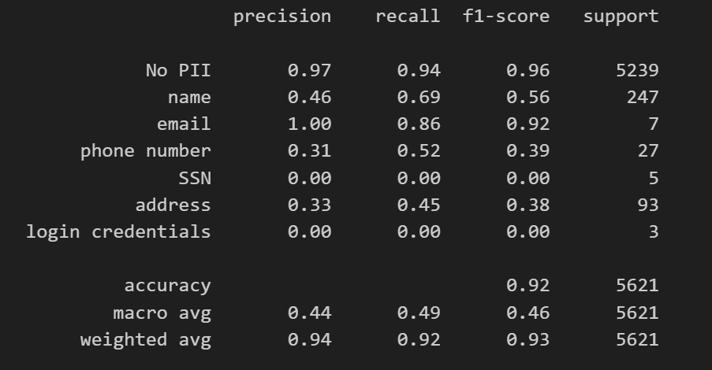

# DistilBERT for PII Text Classification

This repository contains code and resources for **fine-tuning DistilBERT** to automatically classify text strings into **sensitive information categories**.  
The model distinguishes between different types of commonly found **Personally Identifiable Information (PII)** such as:

- Name  
- Email  
- Phone number  
- Social Security Number (SSN)  
- Addresses  
- Login credentials (username, passwords)  
  

The goal is to provide a practical NLP pipeline for detecting and categorizing sensitive information in text.

---

## 📂 Repository Structure

```
.
├── data/ # Training and validation datasets used for fine-tuning
├── distilbert-pii/ # Output fine-tuned DistilBERT model (config, weights, tokenizer, label2id)
├── distilbert.ipynb # Main Jupyter notebook for fine-tuning and evaluation
├── README.md # Project documentation
└── .gitattributes # Git configuration
```

---

## 🚀 Getting Started

### 1. Clone the repository
```bash
git clone https://github.com/tiktok-tech-jam-2025/ByteMyBrains_DistilBERT.git
cd ByteMyBrains_DistilBERT
```

### 2. Install dependencies
You’ll need Python 3.9+ and Hugging Face Transformers.
```bash
pip install torch torchvision torchaudio
pip install transformers datasets evaluate scikit-learn
```

Other useful packages:

```bash
pip install matplotlib jupyter
```

### 3. Training dataset 
- The data/ folder contains the text datasets used for fine-tuning.
- Each row consists of a text column and a label column, where the label corresponds to one of the 7 categories.

| Label ID | Category           |
|----------|--------------------|
| 0        | No PII             |
| 1        | name               |
| 2        | email              |
| 3        | phone number       |
| 4        | SSN                |
| 5        | addresses          |
| 6        | login credentials  |
 
The dataset was generated by first extracting out textual information from images in this [Kaggle dataset](https://www.kaggle.com/datasets/patrickaudriaz/tobacco3482jpg?resource=download) using an OCR model, which are then sent for labelling by the vision model **gpt-4o-mini**, before being saved into a final dataset csv. The exact pipeline used is the `image_sampling_labeler.ipynb` which can be found in our **dataset_generation** repo [here](https://github.com/tiktok-tech-jam-2025/dataset_generation/tree/main/notebooks)

### 4. 📓 Fine-tuning
Run the Jupyter notebook:

```bash
jupyter notebook distilbert.ipynb
```

Inside the notebook:

- Loads a pretrained DistilBERT base model
- Tokenizes and processes the dataset
- Fine-tunes the model on the PII detection dataset
- Saves the trained model artifacts in `distilbert-pii/`

### 5. 📊 Evaluation Results
The notebook includes:

- Training/validation loss tracking


- Classification reports with per-class precision, recall, F1-score


- Confusion matrices


This allows monitoring of model performance across the 7 PII categories.

### 6. 🛡️ Applications

- Data redaction in logs, chat transcripts, or documents

- Preprocessing pipeline for anonymization in ML/analytics

- Compliance with data privacy regulations (GDPR, PDPA, HIPAA, etc.)

### 7. ✨ Acknowledgements

- [Tobacco3482](https://www.kaggle.com/datasets/patrickaudriaz/tobacco3482jpg?resource=download) for dataset
- [DistilBERT](https://huggingface.co/distilbert/distilbert-base-uncased) for model training